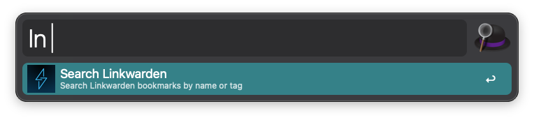
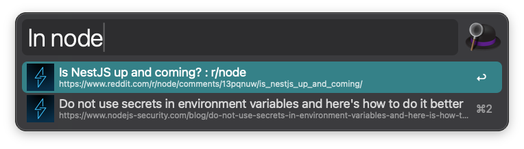

# alfred-linkwarden

An [Alfred](https://www.alfredapp.com/) workflow for interacting with [Linkwarden](https://linkwarden.app/).

## Setup

1. Download and import the `.alfredworkflow` file.
2. Open the workflow's configuration in Alfred and set:
   - **Server URL** — the URL of your Linkwarden instance (e.g. `https://linkwarden.example.com`)
   - **API Key** — your Linkwarden API key (generate one from your Linkwarden account settings)
   - **CA Certificate Path** (optional) — path to a CA certificate file, useful for corporate VPNs that perform SSL inspection

## Usage

### Search bookmarks

Type `ln <query>` to search your Linkwarden bookmarks by name or tag.

- **Enter** — open the link in your browser
- **Ctrl+Enter** — open the preserved (cached) version in Linkwarden

### Save a URL

Type `ln <url>` (e.g. `ln https://example.com`) to check if a URL is already saved. If it isn't, you'll see an option to save it to Linkwarden. Press **Enter** to save.

## Dependencies

- [Node.js](https://nodejs.org/en)
